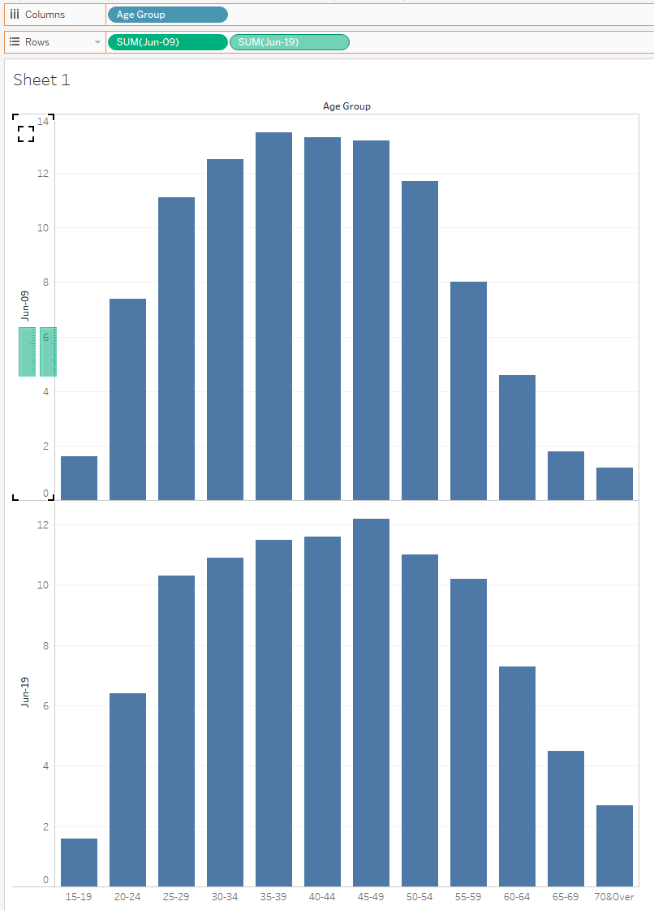

```{r setup, include=FALSE}
knitr::opts_chunk$set(echo = FALSE)
```

# DataViz Makeover 1


# a) 

## Clarity 

### Wrong choice of visualization: 
*Comment*: Age group is a categorical datatype and thus line chart may not be the best way to represent it.

*Suggestion*: Represent categorical datatype using bar chart instead of line chart.

### Unclear Chart title:
*Comment*: Chart title is unclear. It says 'Resident labour force by age' followed by 'Per Cent' at the bottom, which doesn't really help in readers' understanding.

*Suggestion*: Title should mention the distinct time periods that the chart is describing. Change the title to ‘Comparison of resident labour force percentage by age group in June 2009 and June 2019’. 

### Mismatch between statement and visualization:
*Comment*: The statement mentions LFPR increasing but there is no illustration or reference to LFPR in the visualisation. This serves to confuse readers since they may be wondering whether the visualisation is referring to LFPR or just resident labour force.

*Suggestion*: Have a separate visualisation to reference how LFPR has increased from 2009 to 2019 for the various age groups.

## Aesthetic

### Poor Choice of Colours
*Comment*: The 2 colours used for 2009 and 2019 are both relatively dark and thus no visual contrast.

*Suggestion*: Use 2 more contrasting colours to make the distinction between both years more obvious.

### Repetitive Labelling
*Comment*: The labelling for this graph is rather repetitive. For example, you see “June 2009” show up 3 times; 1) in the table below 2) ‘Median Age in June 2009’ at the median line 3) Labelling the line graph. Similar for “June 2019”. This makes the graph look cluttered.

*Suggestion*: Only have one Date label for each date rather than multiple labels for the same date.

### No vertical axis
*Comment*: It is not clear at first sight what the height of the line graph represents.

*Suggestion*: Have a vertical axis on the side of the graph to show that the points on the lines stand for percentage

### x-axis not labelled
*Comment*: Not everyone will immediately know that ’15-19’, ’20-24’ etc represents age groups.

*Suggestion*: Label the axis with ‘Age Group’

# b)
-insert first chart here-

1) By switching from line chart to bar chart, categorical data of age groups is more correctly represented. 

2) By having a y-axis showing ‘Percentage of Workforce’ and labelling the bars, viewers are able to know what the heights of the bars represent. This is opposed to the current design where there is no immediate understanding visually of what the lines represent.

-insert second chart here-

# d)
### Step-by-step description on how data visualization was prepared
1) Input the raw data from the given visualization into Excel

<center>
{width=20%}
</center>

2) Load dataset into Tableau. Double check that data and datatypes are correct before proceeding to make visualization.

<center>
{width=35%}
</center>

3) Drag 'Age Group' into Columns 
Drag 'Jun-09' and 'Jun-19' into Rows

<center>
{width=70%}
</center>

4) Drag 'Jun-19' into the 'Jun-09' y-axis on the top panel of the chart
<center>
{width=70%}
</center>

5) Edit y-axis to change max value to be 20. Change the name of axis to 'Percentage of Workforce(%)'

6) Drag 'Measure Names' from Tables to 'Color'. This makes 'Jun-09' blue and 'Jun-19' yellow

7) Uncheck 'Show Header' on the x-axis. This gets rid of the Jun-09 and Jun-19 labelling on the x-axis.

<center>
{width=70%}
</center>

8) Edit Title of legend to 'Time Period'. Edit Alias for both 'Jun-09' and 'Jun-19' to as follows to inform viewers of the median age for both time periods:
<center>
{width=30%}
</center>

