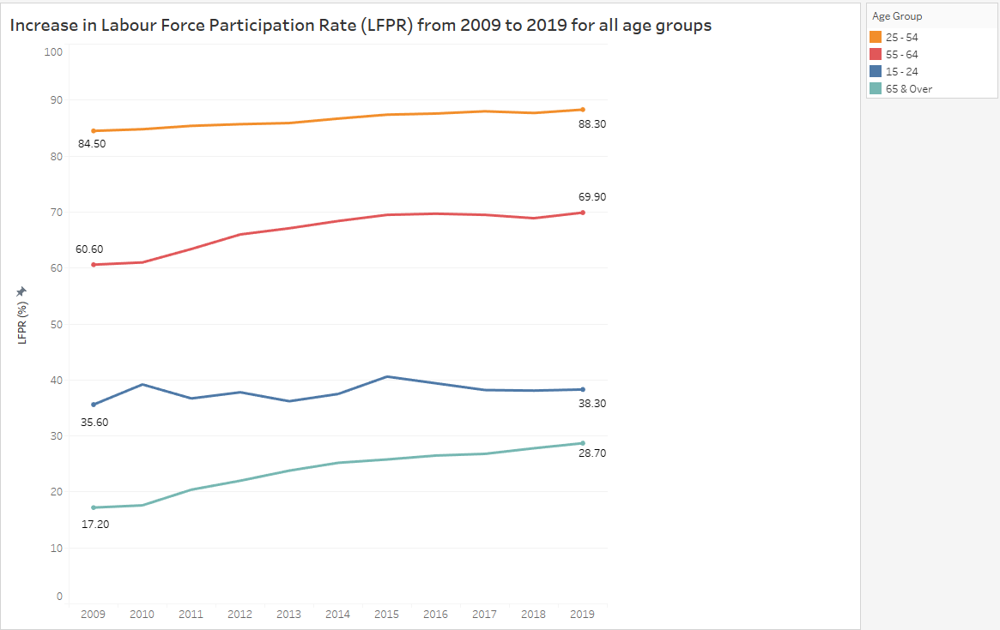
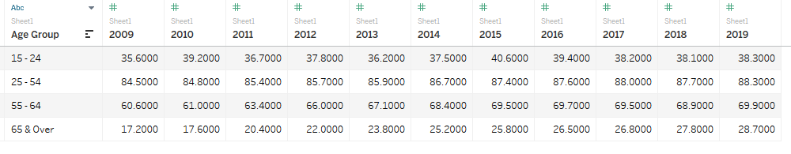
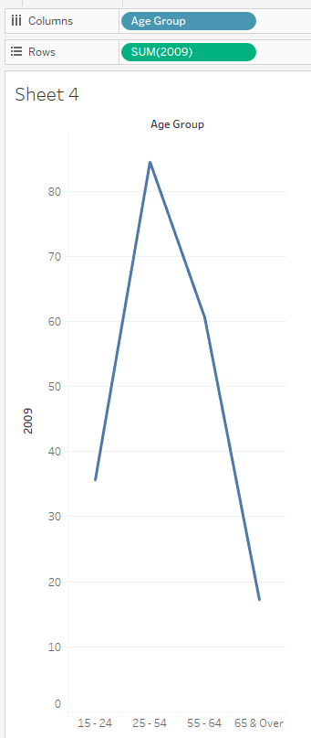
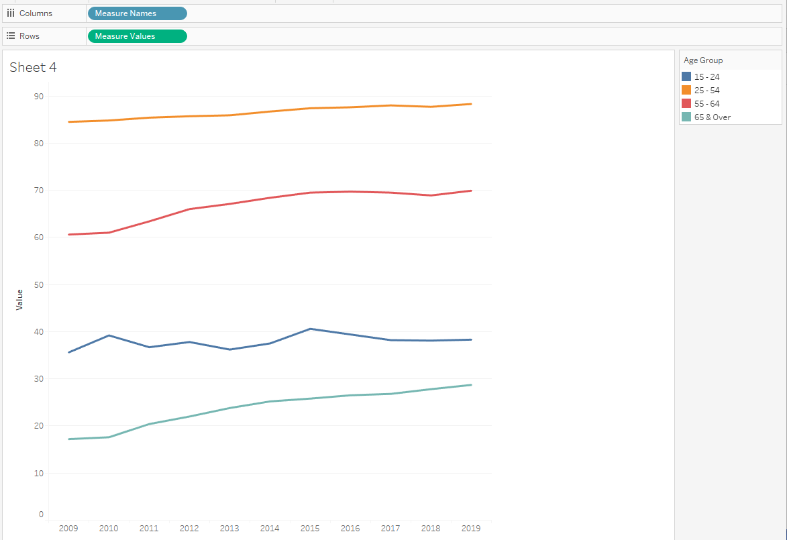
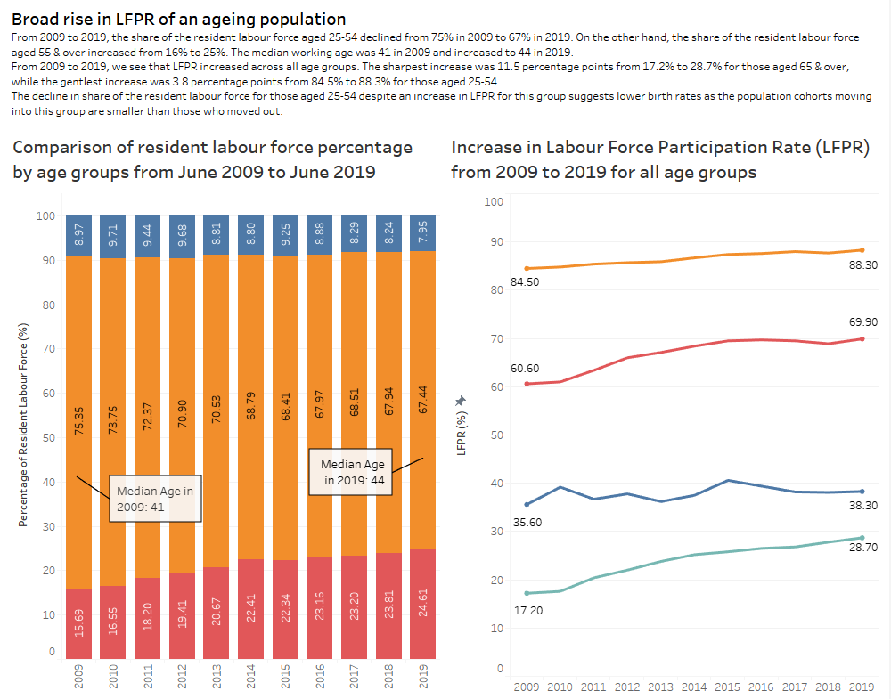

```{r setup, include=FALSE}
knitr::opts_chunk$set(echo = FALSE)
```

# DataViz Makeover 1


# a) 

## Clarity 

### Wrong choice of visualization: 
*Comment*: Age group is a categorical datatype and thus line chart may not be the best way to represent it.

*Suggestion*: Represent categorical datatype using bar chart instead of line chart.

### Unclear Chart title:
*Comment*: Chart title is unclear. It says 'Resident labour force by age' followed by 'Per Cent' at the bottom, which doesn't really help in readers' understanding.

*Suggestion*: Title should mention the distinct time periods that the chart is describing. Change the title to ‘Comparison of resident labour force percentage by age groups from June 2009 to June 2019’. 

### Mismatch between statement and visualization:
*Comment*: The statement mentions LFPR increasing but there is no illustration or reference to LFPR in the visualisation. This serves to confuse readers since they may be wondering whether the visualisation is referring to LFPR or just resident labour force.

*Suggestion*: Have a separate visualisation to reference how LFPR has increased from 2009 to 2019 for the various age groups.

### Chart describes something that isn't visually represented, causing potential confusion:
*Comment*: The statement mentions 'the share of the resident labour force aged 25 to 54 declined from 75% to 67%', but there is no visualization of this at all. This creates a disconnect between the statement and visualization.

*Suggestion*: Bin the age groups and have 1 of them be '25-54' to show this drop from 75% to 67%.

## Aesthetic

### Poor Choice of Colours
*Comment*: The 2 colours used for 2009 and 2019 are both relatively dark and thus no visual contrast.

*Suggestion*: Use 2 more contrasting colours to make the distinction between both years more obvious.

### Repetitive Labelling
*Comment*: The labelling for this graph is rather repetitive. For example, you see “June 2009” show up 3 times; 1) in the table below 2) ‘Median Age in June 2009’ at the median line 3) Labelling the line graph. Similar for “June 2019”. This makes the graph look cluttered.

*Suggestion*: Only have one Date label for each date rather than multiple labels for the same date.

### No vertical axis
*Comment*: It is not clear at first sight what the height of the line graph represents.

*Suggestion*: Have a vertical axis on the side of the graph to show that the points on the lines stand for percentage

### x-axis not labelled
*Comment*: Not everyone will immediately know that ’15-19’, ’20-24’ etc represents age groups.

*Suggestion*: Label the axis with ‘Age Group’

# b)

We make use of 2 charts to improve the current design and better bring out the message of the statement.

**First Chart: Comparison of resident labour force percentage by age groups from June 2009 to June 2019**


1) By binning the age groups and showing the group 25-54 specifically, viewers can now immediately visualize how the percentage of 25-54 dropped from 75% in 2009 to 67% in 2019 over the years. By switching from line chart to bar chart, categorical data of age groups is more correctly represented. 

2) By having a y-axis showing ‘Percentage of Workforce’ and labelling the bars, viewers are able to know what the heights of the bars represent. This is opposed to the current design where there is no immediate understanding visually of what the lines represent.

**Second Chart: Showing the increase in Labour Force Participation Rate (LFPR) from 2009 to 2019 for all age groups**



1) Juxtaposing the first and second chart side by side will allow viewer to visualize what is said in the statement, that despite 
LFPR increasing for age group 25-54, the share of the resident labour force declined from 75% to 67%.

2) The chart shows LFPR actually increased for all age groups from 2009 to 2019. So, the decline from 75% to 67% could also be explained by the fact that the LFPR for other age groups increased more than that of 25-54.

# c)

[Click for link to Tableau Public post](https://public.tableau.com/views/DataVizMakeover1_16117715149820/Dashboard1?:language=en&:display_count=y&publish=yes&:origin=viz_share_link)

# d)

### Step-by-step description on how first chart was prepared
1) Using Table 7, bin the age groups into '15-24', '25-54' and '55 & Over'. Calculate the age groups' percentage of labour force for each year. 

<center>
{width=100%}

</center>
<center>
{width=100%}

</center>

2) Load dataset into Tableau. Double check that data and datatypes are correct before proceeding to make visualization.

<center>
{width=80%}
</center>

3) Drag 'Age Group' into Columns. Drag '2009' into Rows. Under 'Show Me', select Stacked Bar type

<center>
{width=70%}
</center>

4) Select all of 2010-2019 and drag them into the 2009 axis
<center>
{width=70%}
</center>

5) Change the name of axis to 'Percentage of Resident Labour Force (%)'

6) Show Labels to label each shaded area with the corresponding %.

7) Change title to 'Comparison of resident labour force percentage by age groups in June 2009 and June 2019.

8) Annotate the Median Age in both 2009 and 2019 with Point

9) Final product:

<center>
{width=100%}
</center>

### Step-by-step description on how second chart was prepared

1) Using Table 5, extract the data for age groups '15-24', '25-54', '55-64', '65 & Over'

2) Load dataset into Tableau. Double check that data and datatypes are correct before proceeding to make visualization.

<center>

</center>

3) Drag 'Age group' into Columns. 
Drag '2009' into Rows. Select Line chart.
<center>

</center>

4) Drag 2010 to 2019 into 'Measure Values' and remove 'Age Group' from Columns

<center>

</center>

5) Change y-axis Title to LFPR (%)

6) Label the values for only 2009 and 2019 for all age groups

7) Change title to 'Increase in Labour Force Participation Rate (LFPR) from 2009 to 2019 for all age groups'

8) Adjust the sequence of the legend according to the sequence the age groups appear in the chart

9) Adjust y-axis max value to 100

10) Final Product: 
<center>

</center>

### Putting everything into a dashboard

1) Create a new dashboard

2) Drag 'Labour Force Pct' (first chart) to the left side and drag 'LFPR' (second chart) to the right side

3) Add a textbox at the top and type in some key observations from the visualizations

4) Final product:

<center>

</center>


# e)

### Three major observations revealed by the data visualisation prepared

1) LFPR actually increased broadly across all age groups of the population.

2) The share of the labour force aged 25-54 steadily declined over each year from 2009 to 2019, while that aged 55 & over steadily increased each year from 2009 to 2019, with only the exception from 2014 to 2015.

3) The increase in LFPR from 2009 to 2019 was sharpest for age group 65 & over, increasing 11.5 percentage points from 17.2% to 28.7%. The increase in LFPR from 2009 to 2019 was gentlest for age group 25-54, increasing only 3.8 percentage points from 84.5% to 88.3%. 