```{r setup, include=FALSE}
knitr::opts_chunk$set(echo = FALSE)
```

# Given Visualization


# a)
## Clarity

```{r}
library(knitr)
library(kableExtra)
df <- data.frame(sn = c("1", "2","3","4","5","6"), 
                 comment = (c("The legend title ‘Vac1’ is meaningless.", 
                              "The ‘% of strongly agreed to vaccination’ chart is contained within the ‘Which country is more pro-vaccine’ chart. It can be reproduced by merely changing the way the latter chart is presented.",
                              "Continuing from comment 2) above, it also isn’t obvious from the titles of both charts whether they are referring to the same survey question. The chart on the left has the title ‘Which country is more pro-vaccine’ while the chart on the right has the title ‘% of strongly agreed to vaccination’. On inspection and comparison of the bars, it is apparent that they are visualizations of the same question, but the titles alone are not clear about that.",
                            "The visualization only shows the responses by proportion of the countries’ respondents but does not provide insight into the absolute number of respondents. If the sample size for a particular country is small, then the results for that country may not be properly representative.",
                            "Legend does not explain explicitly what responses 2, 3, 4 represent.",
                            "x-axis labelling unclear. For example, ‘% of Total Record’ is unclear and could mean % of all respondents to someone who doesn’t know the background of the data.")), 
                 suggestion = (c("Rename title ‘Vac1’ to ‘Response’.", 
                                 "Do away with the ‘% of strongly agreed to vaccination’ chart as it does not concern anything new on top of the first chart.",
                                 "If 2 charts are referring to the same survey question, their charts should be clear about it.",
                                 "It will help to add information on the absolute number of respondents and possibly add statistical measures like error bars.",
                                 "Label 2 as Slightly Agree, 3 as Neutral, 4 as Slightly Disagree",
                                 "Rename ‘% of Total Record’ as ‘% of each country’s respondents’.")))
kable(df, col.names = c("s/n", "Comment", "Suggestion"), escape = F) %>%
  kable_styling(latex_options = "hold_position") %>%
  column_spec(1, bold = T) %>%
   column_spec(2, width = "30cm") %>%
  column_spec(3, width = "13cm") %>%
  row_spec(0, align = "c", background = "gray")
```

## Aesthetics
```{r}
library(knitr)
library(kableExtra)
df <- data.frame(sn = c("7", "8","9","10"), 
                 comment = (c("For ‘Which country is more pro-vaccine?’ chart, the responses are portrayed as ‘5’ on the left to ‘1’ on the right. This is the inverse way in which the legend is portrayed, which isn’t the most visually intuitive.", 
                              "The x-axis of the left chart is in whole numbers while the x-axis of the right chart is to 1 decimal place. There is no need for there to be 1 decimal place precision as the x-axis intervals are already so wide.",
                              "It is aesthetically odd for the ‘united kingdom’ bar to go beyond the maximum value of the x-axis.",
                            "If x-axis already shows units is %, no need to label each tick with %.")), 
                 suggestion = (c("Portray the responses as 1 on the left to 5 on the right.", 
                                 "Make both x-axis of the same whole number precision.",
                                 "Make all of the chart values to stay within the maximum bound of axes.",
                                 "Remove % from the x-axis tick marks.")))
kable(df, col.names = c("s/n", "Comment", "Suggestion"), escape = F) %>%
  kable_styling(latex_options = "hold_position") %>%
  column_spec(1, bold = T) %>%
   column_spec(2, width = "30cm") %>%
  column_spec(3, width = "13cm") %>%
  row_spec(0, align = "c", background = "gray")
```


# b)

## Sketch of proposed design


### Advantages of proposed design

```{r}
library(knitr)
library(kableExtra)
df <- data.frame(sn = c("1", "2","3","4"), 
                 comment = (c("The Likert Scale is good to visualize attitude or belief items such as the willingness to receive the COvID19 vaccine in this study. By centering around 0, it is visually intuitive at one glance to see if respondents of a country lean more towards agreeing or disagreeing.", 
                              "By allowing for filtering of different profiles such as gender, age group, household size bracket etc, the user is able to derive more pointed insights rather than a static view of the entire population",
                              "By showing the Error Bars in the Dot Plot, one is able to be visually informed how certain one can be of the study results based on the data of each group of respondents. It provides visual information regarding the variability of the data and is useful as predictors of the range of new samples.",
                            "Allowing for the user to select from a list of questions regarding public perception of the vaccine in different contexts allows for a variety of insights regarding the issue, rather than just from one perspective as provided in the original visualization.")))

kable(df, col.names = c("s/n", "Advantage"), escape = F) %>%
  kable_styling(latex_options = "hold_position") %>%
  column_spec(1, bold = T) %>%
   column_spec(2, width = "30cm") %>%
  row_spec(0, align = "c", background = "gray")
```

# c)

[Click for link to Tableau Public post](https://public.tableau.com/views/DataVizMakeover2_16136605457720/Dashboard2?:language=en&:display_count=y&publish=yes&:origin=viz_share_link)

# d)

### For this makeover, the visualization comes in the form of 2 charts: 1) Likert Scale and 2) Dot Plot with Error Bars.

We go through the Data Source Preparation steps first before going through the steps to build the 2 charts proper.

## Data Source Preparation
1) Download the data for the relevant countries from [https://github.com/YouGov-Data/covid-19-tracker/tree/master/data](https://github.com/YouGov-Data/covid-19-tracker/tree/master/data) 

2) Open 'australia.csv' as the first Data Source. 

3) Remove it as shown in the screengrab below.

<center> 

{width=100%}

</center>
4) Create a New Union comprising the 14 tables for the 14 countries

<center>


</center>

5) Create new aliases for the countries under 'Table Name' field.

<center>

{width=70%}

</center>

6) Rename 'Table Name' field to 'Country'.

7) Create aliases for all the survey questions' responses (vac_1, vac_2, vac2_1, vac2_2, vac2_3, vac2_6, vac_3) as shown below. This is to facilitate building calculated Field later on where there is inequality in the formula based on the survey responses.

<center>

{width=80%}

</center>

8) Inspect the data. On inspection, it seems that the Sweden does not have any data under the union as the 'RecordNo' field which all the other files are joined under is saved as 'record' instead. Rectify this in the raw 'sweden.csv' file and redo the union, checking that this is fixed and Sweden data is successfully joined this time.

<center>

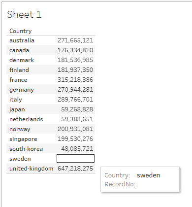

</center>

## Creating new parameters and fields to build the Likert Scale

1) Hide the unneeded fields from the data which we will not be using for the visualization. We retain the following fields:

<center>

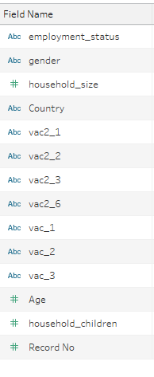{width=90%}

</center>

2) Create new Calculated Field called 'Age Group' as follows:

<center>


</center>

The ages are binned accordingly so that viewers can view results by meaningful distinct age groups.

3) Create new Calculated Field called 'Household Size Bracket' as follows: 

<center>


</center>

The household sizes are binned accordingly so that viewers can view results by meaningful household size brackets

4) Create new Calculated Field called 'Number of Children' as follows:

<center>


</center>

The number of children in each household is binned accordingly so that viewers can view results by meaningful brackets of the number of children in each household.

5) Create a new Parameter called 'Select Question'. This is in view of creating a Dropdown Filter for the viewer to select the relevant question he/she would like to view the visualization results for.

<center>

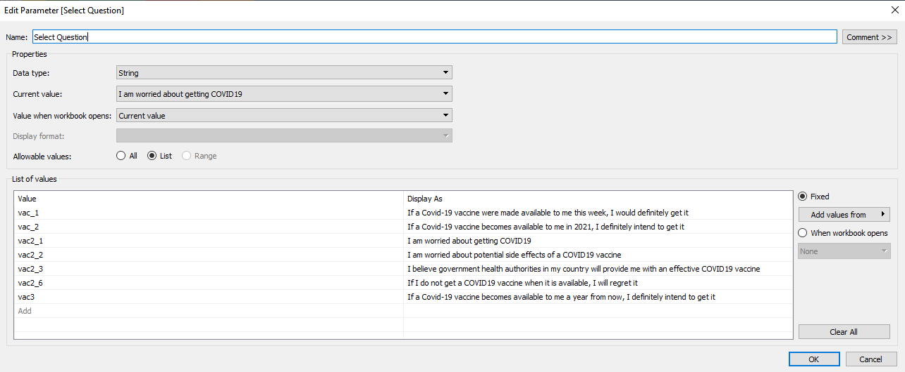{width=80%}

</center>

6) Create Calculated Field called vac1_reversescore as follows:

<center>

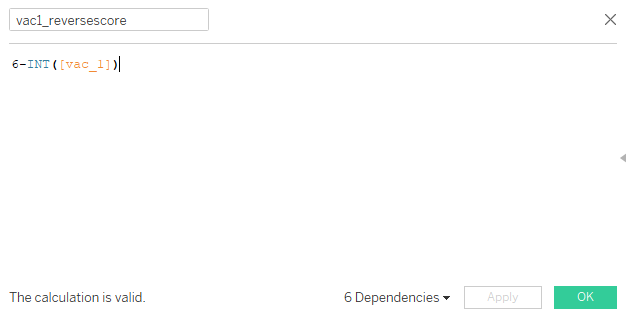

</center>

This reverses the order of the scores where 5-Strongly Disagree now has a score of 1, while 1-Strongly Agree has a score of 5. This is for the construction of the Likert Scale where responses below 3 (Neutral) are for negative responses. Create the same fields for all the other survey questions (vac_2, vac2_1, vac2_2, vac2_3, vac2_6, vac_3).

Make sure to label in the Response Legend that 1 corresponds to Strongly Disagree, 2 to Disagree, 3 to Neutral, 4 to Agree and 5 as Strongly Agree.

7) Create new Calculated Field called 'Selected Question' as follows:

<center>

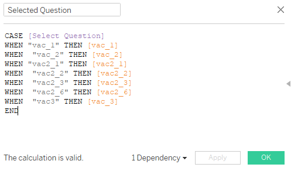

</center>

8) Create Calculated Field called 'Number of Records' =1 as follows: This is used as a dummy to add up Number of Records.

<center>

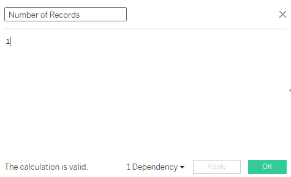

</center>

9) Create Calculated Field called 'Total Count' as follows:

<center>


</center>

10) Create Calculated Field called 'Count Negative' as follows:

<center>

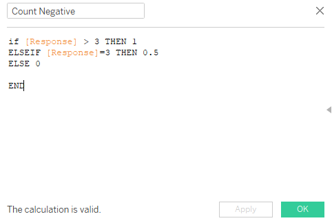

</center>

11) Create Calculated Field called 'Total Count Negative' as follows:

<center>


</center>

12) Create Calculated Field called 'Percentage' as follows:

<center>

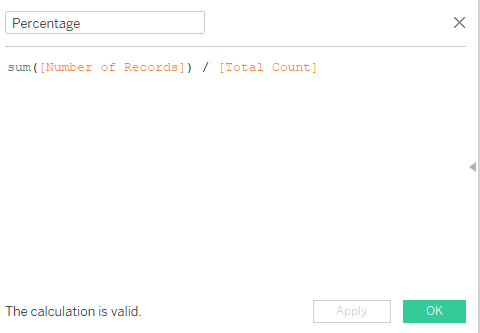

</center>

13) Create calculated Field called 'Gantt Start' as follows:

<center>


</center>

14) Create Calculated Field called 'Gantt Percent' as follows:

<center>


</center>

## Building the Likert Scale

1) Drag Gantt Percent to Columns

2) Drag Country to Rows. Chart will first look as follows:

<center>

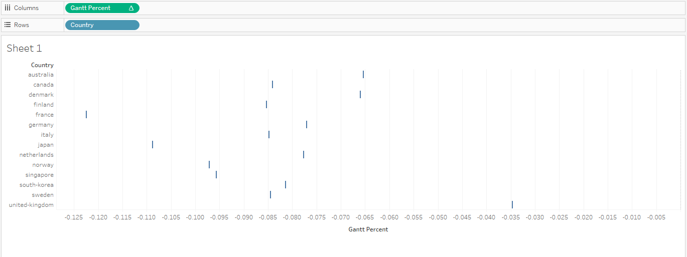{width=80%}

</center>

3) Drag Response to Detail under the Marks tab

4) Under Gantt Percent, select Compute using Response as follows:

<center>

{width=80%}

</center>

5) Change Chart Type to Gantt Bar under Marks

6) Drag Response to Colour under the Marks tab

7) Drag Percentage to Size under the Marks tab. Chart will now look as follows:

8) Drag Score into Filters tab and uncheck Null so Null responses are disregarded throughout.

<center>


</center>

9) Show the Parameter 'Select Question'. This shows up as a Dropdown Bar. 

10) Change the Chart Title to be dynamic according to the question selected as follows:

<center>

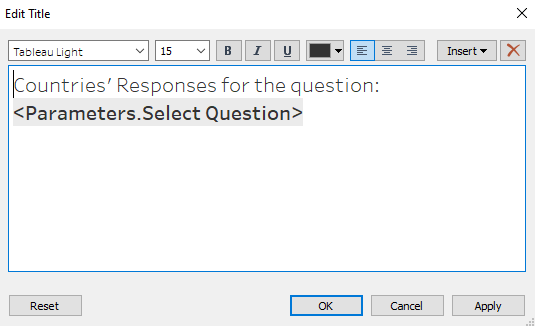

</center>

11) Drag Age Group into Filters tab:

<center>

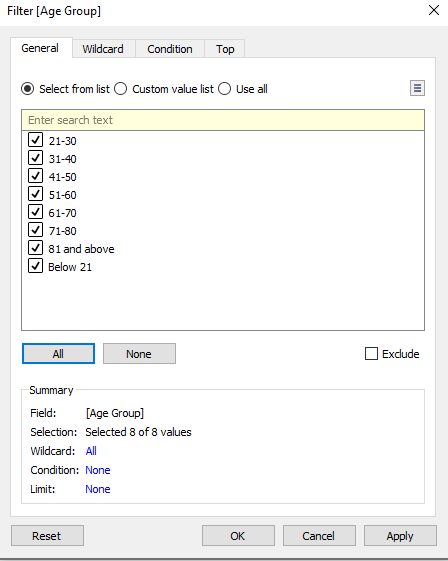

</center>

Show Age Group as a Multiple Values Dropdown list

12) Drag 'gender' into Filters tab:

<center>


</center>

Show gender as a Multiple values list

13) Drag employment_status into Filters tab:

<center>

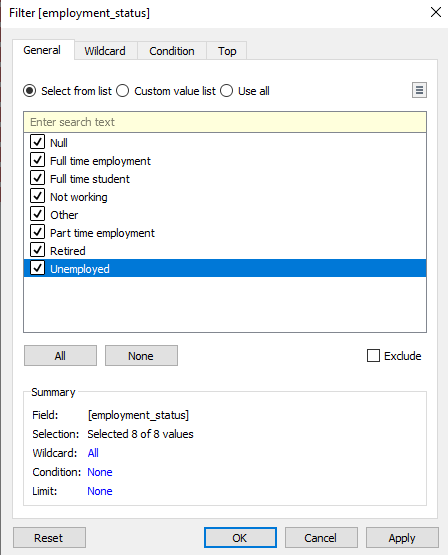

</center>

Include Null as an allowed value although it accounts for an insignificant number of responses. User can uncheck it to phase it out if desired.

Show employment_status as a Multiple Values Dropdown list

14) Drag 'Household Size Bracket' into Filters tab:

<center>

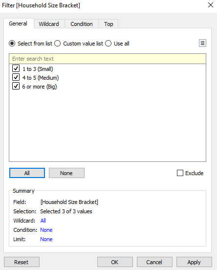

</center>

Show Household Size Bracket as a Multiple Values Dropdown list

15) Drag 'Number of Children' into Filters tab:

<center>


</center>

Show Number of Children as a Multiple Values Dropdown list

Likert Scale is as follows, before any formatting:

<center>

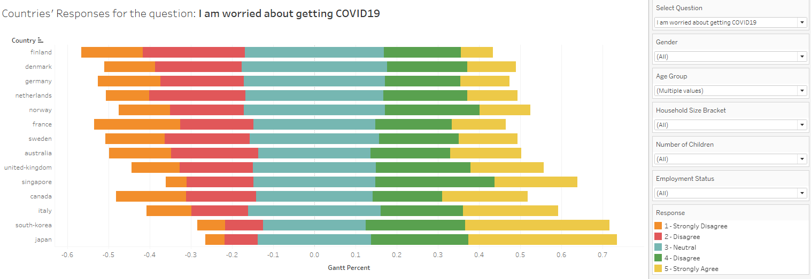

</center>

## Creating new parameters and fields to build the Dot Plot with Error Bars

We next build Dot Plot with Error Bars. For each set of filters selected by the user, this Dot Plot will show the Proportion of Respondents from each Country with a 'Strongly Agree' response, accompanied by Error Bars showing the 95% Confidence Intervals. This is an improvement from the original '% of strongly agreed to vaccination' chart, as it not only allows for filtering of profiles but also shows the confidence intervals based on the sample size of each country.

1) Create Calculated Field called Strongly Agree Count as follows:

<center>


</center>

This is to mark each Strongly Agree response as 1 count. Create the same fields for the other 4 responses.

2) Create Calculated Field called 'Proportion of Respondents_Strongly Agree' as follows:

<center>


</center>

This is to count the proportion of respondents which selected Strongly Agree out of the total number of records. Create the same fields for the other 4 responses.

3) Create Calculated Field called 'Proportion Standard Error_Strongly Agree' as follows:

<center>

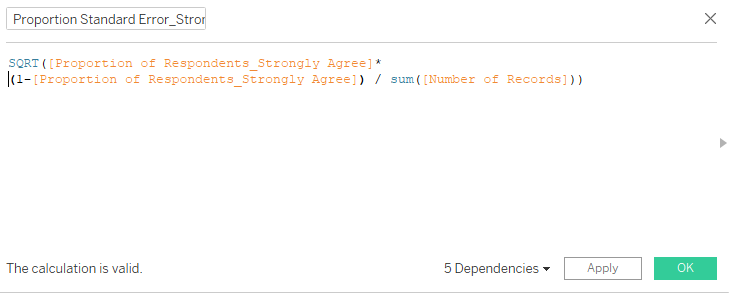

</center>

This is to calculate the standard error. Create the same fields for the other 4 responses.

4) Create Calculated Field called Z_95% as follows:

<center>


</center>

This is the critical z-score for 95% confidence level

5) Create Calculated Field called 'Upper 95%_Strongly Agree' as follows:

<center>

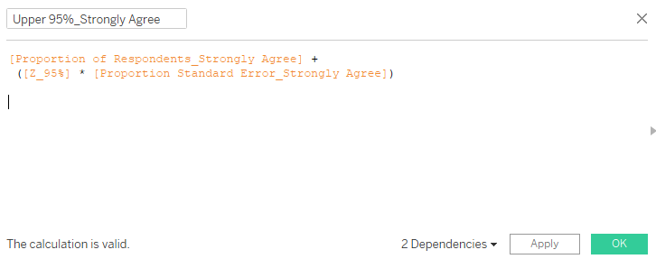

</center>

This is to calculate the upper 95% confidence level for the proportion of respondents who answered Strongly Agree. Create the same fields for the other 4 responses.

6) Create Calculated Field called 'Lower 95%_Strongly Agree' as follows:

<center>


</center>

This is to calculate the lower 95% confidence level for the proportion of respondents who answered Strongly Agree. Create the same fields for the other 4 responses.

7) Create Calculated Field 'Lower 95% Level' as follows:

<center>

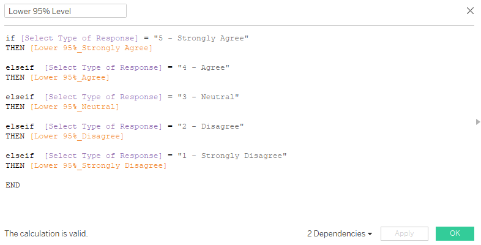

</center>

This is to generate the correct lower 95% level according to the type of response which the user wishes to see the lower 95% level for.

8) Create Calculated Field 'Upper 95% Level' as follows:

<center>


</center>

This is to generate the correct upper 95% level according to the type of response which the user wishes to see the upper 95% level for.

9) Create Parameter 'Select Type of Response'. This is to select the type of response for which we wish to see the Dot Plot with Error Bars for.

<center>

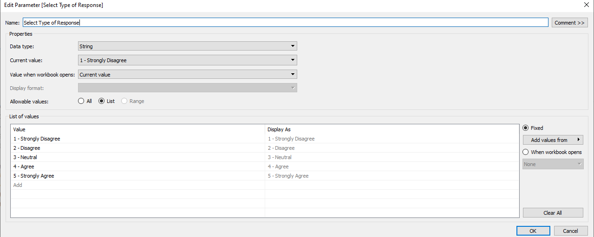

</center>

10) Create Calculated Field called 'Select Response Type'. This is to display the correct proportion of respondents' responses for the response type which the user selects in step 7 above.

<center>


</center>

## Building the Dot Plot with Error Bars

1) Drag 'Select Response Type' to Columns

2) Drag Country to Rows

3) Change Marks type to Circle. At this point chart looks as follows:

<center>

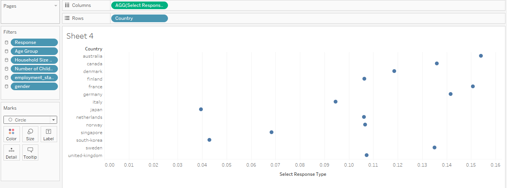{width=80%}

</center>

4) Drag Measure values to the 'top x-axis' and then exclude everything except the Upper 95% Level and Lower 95% Level


5) Click on Measure values in the Marks tab and change Marks type to Line. This generates a squiggly line across the chart as follows:

<center>

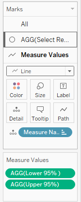

</center>

<center>


</center>

6) Drag Measure Names to Path to generate the line which represents the 95% confidence interval.

<center>

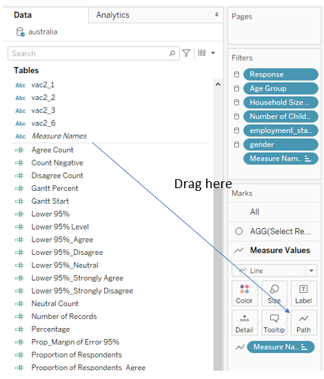

</center>

7) Right click x-axis and click Synchronize Axis

<center>


</center>

8) Format the colour of the Dot to make it different from the colour of the Error Bars

## Compile both Likert Scale and Dot Plot with Error Bars into a single dashboard for integration and incorporate user-friendly interface

1) Create a new Dashboard

2) Drag sheets 'Likert' and 'Final Error Bars' into the dashboard side by side. It will look as follows:

<center>

{width=100%}

</center>

3) To synchronize the order of the countries on both charts, go to the Likert sheet, right click on the y-axis and select Sort. Sort by Field, where the Field Name is 'Select Response type' in Ascending order. For example, if user selects to view the Dot Plot for '1 - Strongly Disagree', both charts will be sorted with the country on the top having the least proportion of 'Strongly Disagree' and the country on the bottom having the highest proportion of 'Strongly Disagree'. 

<center>


</center>

4) Move the Select Question dropdown list to the top. This is so that the entire question can be shown and not truncated.

5) Move the select 'Type of Response' dropdown list below 'Select Question'

6) Drag all the profile filters (gender, Age group, Household Size Bracket, Number of children and employment status) to the bottom of the dashboard.

7) Create a text box to direct the user to filter to view results based on different profile combinations.

<center>

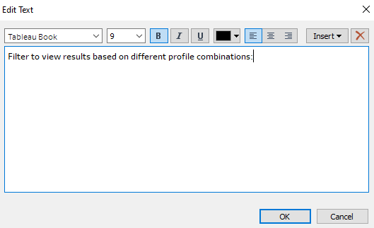

</center>

8) Capitalize first letter of each profile filter group to tidy the look.

9) go to the Final Error Bars sheet. To show the number of records for each country for that particular question, drag 'Number of Records' into the All tab under Marks as follows:

<center>

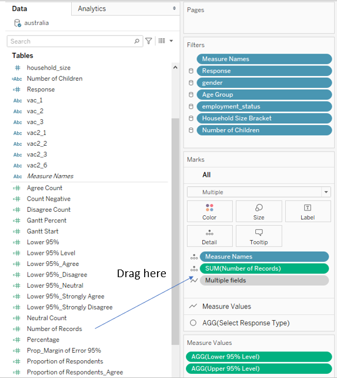

</center>

10) Then edit the tooltip under the same All tab as above:

<center>


</center>

11) Change the title for the Dot Plot chart to as follows:

<center>

{width=100%}

</center>

12) Add Dashboard Title 'A study to understand the willingness and perception of receiving the COVID19 vaccine across different countries'

Final product:

<center>


</center>

# e)

### Three major observations revealed by the data visualisation prepared

1. When asked if they would get the vaccine if it becomes available in 2021, **France is the country most against** it with 34% of respondents indicating they strongly disagree. On the other hand, **South Koreans are least against it**, with only 6% indicating they strongly disagree. 
 It is also interesting that the 3 countries with **least proportion of 'Strongly Disagree' are Asian countries**, whereas the top 3 countries with **highest proportion of 'Strongly Disagree' are all Western countries**. This could be due to cultural perceptions of vaccines.

<center>

{width=80%}

</center>

2) **Females are significantly more worried than males about the potential side effects of a vaccine**. Taking 30% as a reference point, in 11 out of the 14 countries, more than 30% of females indicated strongly agree. On the contrary, only in 2 out of the 14 countries did more than 30% of males indicate strongly agree. 

This is in line with scientific evidence that females are generally more risk-averse than males.

<center>


</center>

<center>

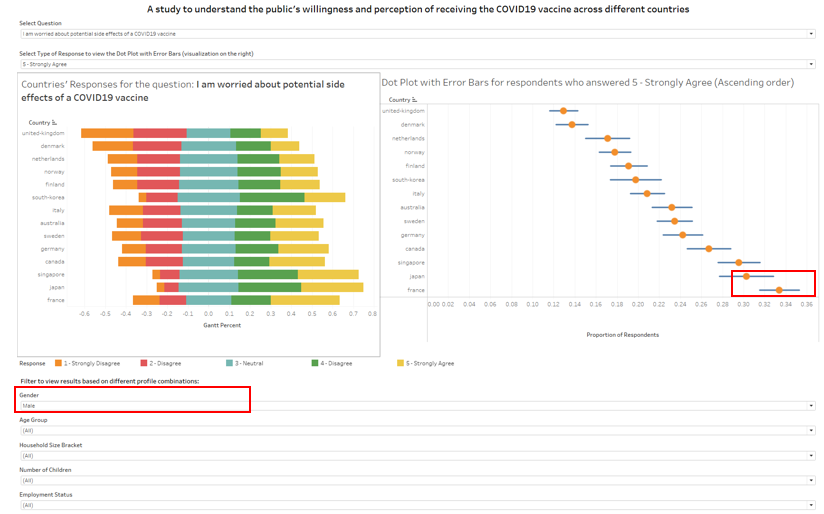

</center>

3) Generally the **elderly are more worried than the young about getting COVID19**. Taking the elderly as those of above 60 years old, and the young as those up to 30 years old. Using 20% as a reference point, in 11 out of 14 countries, more than 20% of the elderly indicated strongly agreed that they are worried about getting COVID19. On the contrary, only in 4 out of the 14 countries did more than 20% of youth strongly agreed that they are worried about getting COVID19.

This is probably due to the fact that there has been published statistical evidence that the elderly are more susceptible to being more adversely affected and have a higher death rate when hit by COVID19 as compared to the young, who have a much higher and faster recovery rate.

<center>


</center>

<center>

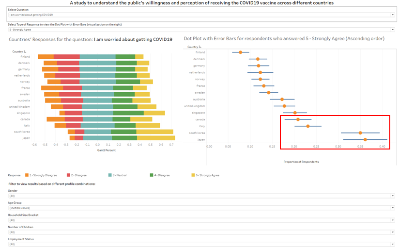

</center>
