```{r setup, include=FALSE}
knitr::opts_chunk$set(echo = FALSE)
```

# Given Visualization


## Clarity

```{r}
library(knitr)
library(kableExtra)
df <- data.frame(sn = c("1", "2","3","4"), 
                 comment = (c("Armed Conflict Event by Type serves the purpose of comparing how counts of each Event Type changes over the years. 

However, it is difficult to compare trends and counts over time across Event Types since each have their own charts of different y-axis scales.",
"All the points are of the same size and only differentiated by colour via the Event Types. In doing so, the visualisation fails to portray the severity of the different armed conflict events, which can be measured by number of fatalities in each event.",
  "For the y-axis label of Armed Conflict Event by Type, ‘Count of Sheet1’  does not provide any meaning.",
  "x-axis label of Armed Conflict Event by Type is shown as ‘Event Date’. This is misleading since it is merely Event Year.")), 
    suggestion = (c("Reorganise Armed Conflict Event by Type into a single chart comprising all the Event Types sharing one scale.",
                    "Scale the size of each point by the number of fatalities. This allows the viewer to visualize the severity of each event.",
"Rename to ‘Count of Event’",
 "Change to ‘Event Year’")))

kable(df, col.names = c("s/n", "Comment", "Suggestion"), escape = F) %>%
  kable_styling(latex_options = "hold_position") %>%
  column_spec(1, bold = T) %>%
   column_spec(2, width = "30cm") %>%
  column_spec(3, width = "13cm") %>%
  row_spec(0, align = "c", background = "gray")
```


## Aesthetics


```{r}
library(knitr)
library(kableExtra)
df <- data.frame(sn = c("5", "6","7"), 
                 comment = (c("The colour of the lines in the line graphs for the different Event Types are all blue, which corresponds to the colour code of Event type ‘Battles’.

This creates potential confusion.
",
  "For the x-axis tick label of Armed Conflict Event by Type, the final tick label ‘2020’ is chopped off. This is aesthetically unpleasant.",
  "For Armed Conflict Event by Type visualization, the height of the visualisation is quite high and all 6 component charts use the same x-axis at the bottom. As it is, it is hard to match the points to the x-axis especially for the component charts at the top such as for Event Type ‘Battles’.")), 
    suggestion = (c("The colour of the lines should match the corresponding colour of the Event Type as represented in the legend.", 
"Adjust for all tick labels to be visible and none chopped off.",
 "Add in Gridlines to allow for easy visual matching of points to x-axis.")))

kable(df, col.names = c("s/n", "Comment", "Suggestion"), escape = F) %>%
  kable_styling(latex_options = "hold_position") %>%
  column_spec(1, bold = T) %>%
   column_spec(2, width = "30cm") %>%
  column_spec(3, width = "13cm") %>%
  row_spec(0, align = "c", background = "gray")
```

## Interactivity

```{r}
library(knitr)
library(kableExtra)
df <- data.frame(sn = c("8", "9","10"), 
                 comment = (c("There is limited interactivity for the filtering of country. The given visualization only allows for Single Value filtering of country. This disallows the viewer from visually comparing 2 countries by selecting 2 of them at one go, for example. ",
  "There is no interactivity option for filtering based on Event Type. For example, if viewer is only interested in viewing Battles in Myanmar, he/she is unable to do so and instead has to view all Event Types.",
  "Viewer is unable to select specific years to view if he/she is interested in selected years other than 2015-2020, which is the default provided by existing visualisation.")
  ), 
    suggestion = (c("Allow for Multiple Value Selection for Country", 
"Allow for filtering of Event Type",
"Allow viewer to filter for Years.")))

kable(df, col.names = c("s/n", "Comment", "Suggestion"), escape = F) %>%
  kable_styling(latex_options = "hold_position") %>%
  column_spec(1, bold = T) %>%
   column_spec(2, width = "30cm") %>%
  column_spec(3, width = "13cm") %>%
  row_spec(0, align = "c", background = "gray")
```


# Proposed alternative data visualisation and interactive techniques

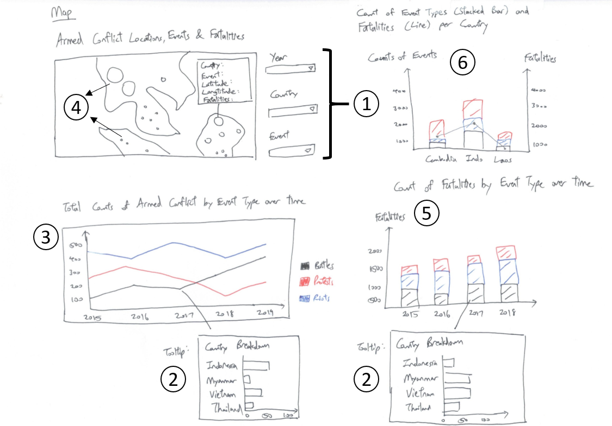

```{r}
library(knitr)
library(kableExtra)
df <- data.frame(sn = c("1", "2","3","4","5","6"), 
                 advantage = (c("Allowing for interactivity selection of Year, Country and Event Type provides the viewer with more options for selective viewing rather than a static view", 
                              "Adding tooltip interactivity when viewer mouse over a point on the chart allows for more granular breakdown of counts by Country, allowing the viewer to glean greater depth of insights",
                              "Combining all the Event Types on 1 single chart allows for easier viewing as compared to the original visualisation which was a panel of 6 charts sharing same axes.",
                            "Scaling the size of each Armed Conflict event by the number of fatalities provides the viewer an additional piece of information about each event. This is an improvement over the original visualisation where each point is the same size and there is no information about severity of each event.",
                            "Having a stacked Bar Chart showing the breakdown of fatalities by Event Type not only allows viewer to see which types of events account for the highest/lowest numbers of fatalities each year, but also allows viewer to see the trend of total fatalities over time.",
                            "Having a Dual-axis Chart showing Count of Event Types and Fatalities by Country allows viewer to not only have a more granular overall breakdown of the event types by country but also through the synchronized axis see the relationship between event count and fatalities count for each country.")))

kable(df, col.names = c("s/n", "Advantage"), escape = F) %>%
  kable_styling(latex_options = "hold_position") %>%
  column_spec(1, bold = T) %>%
   column_spec(2, width = "30cm") %>%
  row_spec(0, align = "c", background = "gray")
```


# Preparing the Visualisation

The final visualisation product takes the form of a dashboard containing:
1) Map showing points of Armed Conflict 

2) Stacked Bar Chart showing Count of Fatalities by Event Type in each year

3) Line Graph showing Total Counts of Armed Conflicts by Event Type

4) A dual-axis chart showing Counts of Event Type by Country (Stacked Bar) and Total Fatalities by Country (Line Graph)

## Map

1) Import the ACLED data into Tableau

2) Drag Longitude into columns and drag Latitude into rows. Map will first look as follows:

<center>

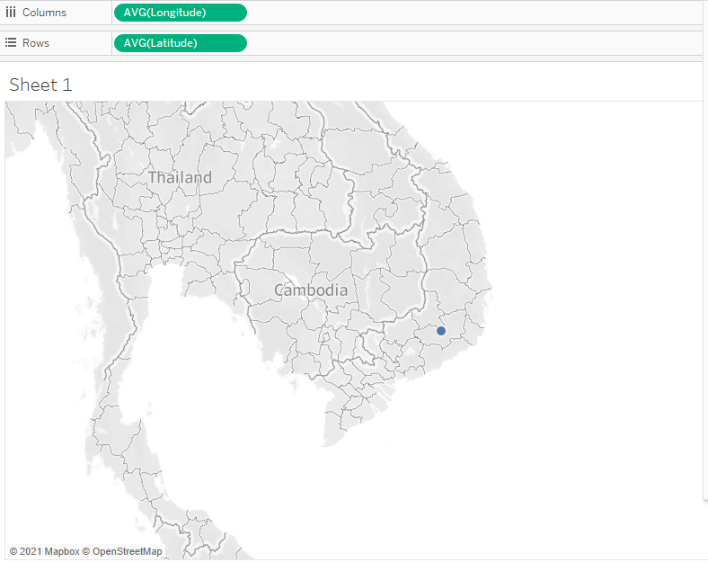

</center>

3) Drag 'Event Type' to Color under the Marks tab.

<center>


</center>

4) Drag 'Event Id Cnty' to Detail under the Marks tab.

<center>


</center>

5) Drag 'Fatalities' to Size under the Marks tab.

<center>


</center>

6) Change Year Data Type from Continuous to Discrete

<center>


</center>


7) Drag Year into Filters tab and select 2015 until 2020 as the default values initially.

<center>

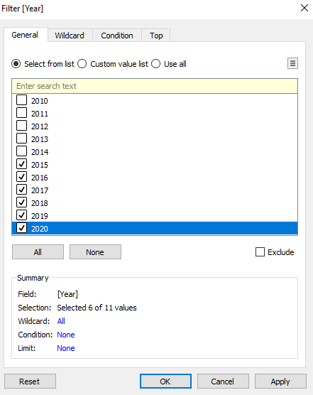

</center>

8) Select Show Filter to allow for viewer to select the desired year(s)

<center>


</center>

9) Change filter type to Multiple Values (dropdown)

<center>


</center>

10) Drag Country into Filters tab and select 'Use all' values.

<center>


</center>

11) Select Show Filter to allow for viewer to select the desired country(s)

<center>


</center>

12) Change Filter type to Multiple Values (dropdown)

<center>


</center>


13) Drag Event Type into Filters tab and select 'Use all' values.

<center>


</center>

14) Select Show Filter to allow for viewer to select the desired Event Type(s)

<center>


</center>

15) Change filter type to Multiple Values (dropdown)

<center>


</center>

16) Drag Country into Tooltip so that can viewer can see the exact Country when hovering over a point to avoid confusion.

<center>


</center>

17) Change Map title as follows:

<center>


</center>


18) Map will look as follows:

<center>

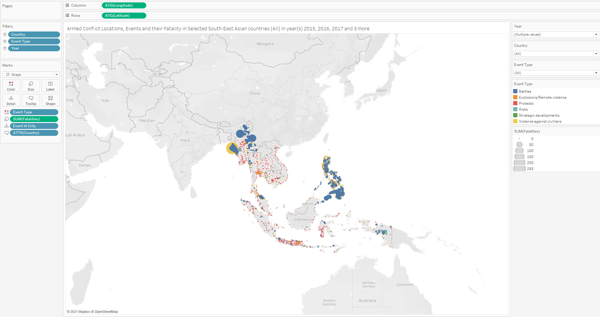

</center>


## Stacked Bar Chart

1) Drag Year into columns and drag Fatalities into rows. Chart will first look as follows:

<center>


</center>

2) Drag 'Event Type' to Color under the Marks tab.

<center>


</center>

3) Change Title as follows:

<center>

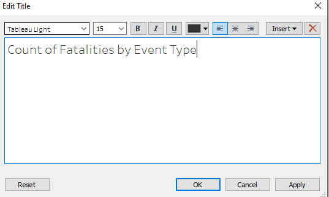

</center>

4) Stacked Bar Chart will look as follows:

<center>

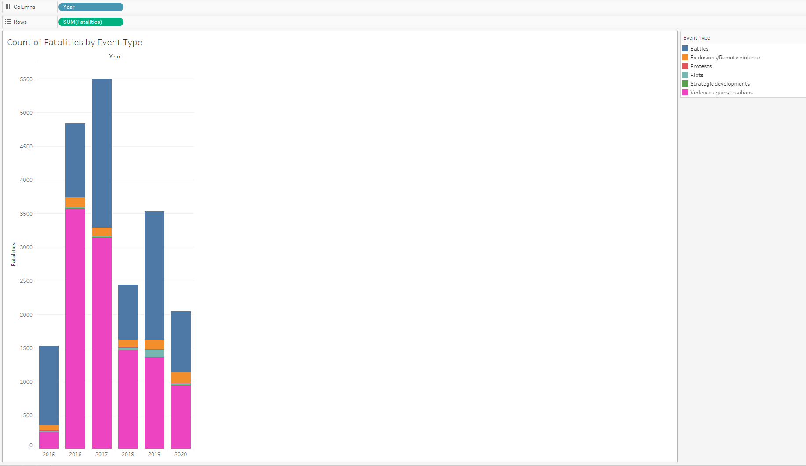

</center>

### Stacked Bar Chart Tooltip - Horizontal Bar Chart

We add a tooltip comprising a Horizontal Bar Chart showing the breakdown of Fatalities by Country when the viewer mouses over each component in the Stacked Bar Chart created above.

1) Create a new worksheet and drag Fatalities into Columns and Country into Rows. A Horizontal Bar Chart is generated by default.

<center>


</center>

2) Go back to the Worksheet of the Stacked Bar Chart and edit the Tooltip of the Chart as follows:

<center>

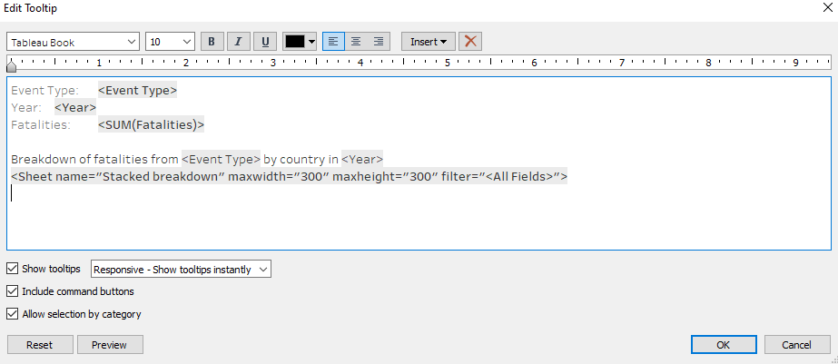

</center>

3) Final Stacked Bar Chart with Horizontal Bar Tooltip looks as follows as an example:

<center>


</center>

## Line Graph

The next element to go into the final dashboard will be a Line Graph showing the Total Counts of Armed Conflicts by Event type over the Years.

1) Drag Year into columns and drag Event Type into rows. 

2) Change Measure of Event Type to Count

<center>


</center>

3) Drag 'Event Type' to Color under the Marks tab.

4) Change y-axis to Logarithmic scale

<center>

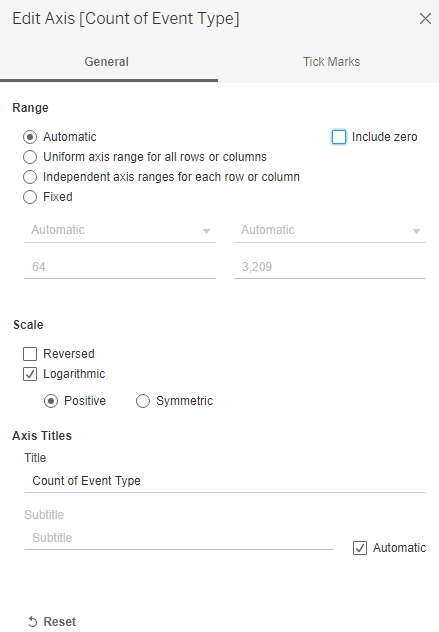

</center>

5) Final Line graph looks as follows:

<center>


</center>


### Line Graph Tooltip - Horizontal Bar Chart

We add a tooltip comprising a Horizontal Bar Chart showing the breakdown of Event Type by Country when the viewer mouses over each component in the Line Graph created above.

1) Create a new worksheet and drag Event Id Cnty into Columns and Country into Rows. Change the Measure of Event Id Cnty to Count. A Horizontal Bar Chart is generated by default.

<center>

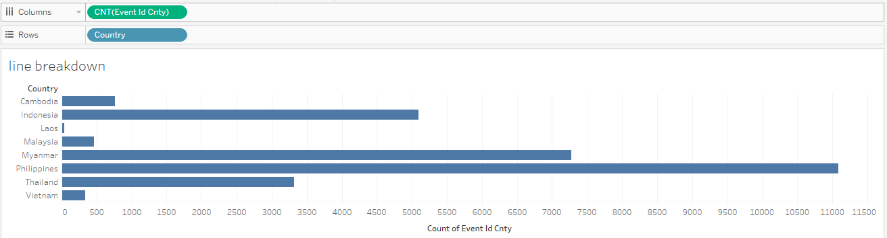

</center>

2) Go back to the Worksheet of the Line Graph and edit the Tooltip of the Chart as follows:

<center>

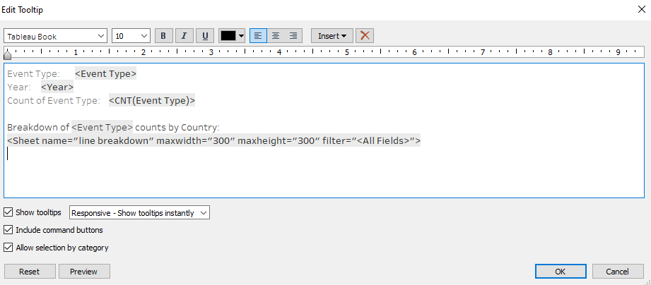

</center>

3) Show Mark Labels for the Horizontal Bar Chart

<center>


</center>

4) Final Line Graph with Horizontal Bar Tooltip looks as follows as an example:

<center>


</center>

## Dual-axis Chart 
Showing Counts of Event Type by Country (Stacked Bar) and Total Fatalities by Country (Line Graph)

1) Create a new worksheet and drag Country into Columns and Event Type into Rows. Change the Measure of Event Type to Count. A Vertical Bar Chart is generated by default.

<center>


</center>

2) Drag Fatalities to the right side of the y-axis as shown below to create Dual Axis:

<center>


</center>

Then change the Chart Type of Sum(Fatalities) to Line under Marks Tab

<center>


</center>

3) Drag Event type to the Color under the Marks Tab for the Stacked Bar Chart CNT(Event Type)

<center>


</center>

4) Change colour of the line of the Line Graph to black. 

5) Show Labels for the Line Graph

6) Final Dual-Axis Graph looks as follows:

<center>


</center>


## Dashboard

1) Create a new Dashboard sheet and change size to Automatic.

<center>

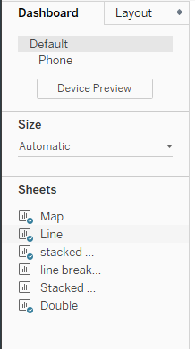

</center>

2) Drag the 4 sheets containing the Map, Dual-Axis Chart, Stacked Bar Chart and the Line Graph to the dashboard. Arrange the map on the left and the other 3 charts on the right.

Place the user-selectable filters (Year, Country and Event Type) in the middle.

3) Switch on Animations to allow viewer to view changes in the visualisations when filter changes are applied

<center>


</center>

4) Dashboard looks as follows:

<center>


</center>

# Five major observations revealed

## Observation 1

<center>


</center>

Over the entire available time period of 2010-2020, Philippines is the country with the densest occurrence of armed conflicts. From the map, we can see that compared to the other countries, Philippines has the largest proportion of its land area having been covered with an occurrence of an armed conflict. 


## Observation 2

<center>


</center>

From the map, we see that Violence against Civilians and Battles tend to result in higher fatalities, whereas other events have low or no fatalities. This is witnessed across the board generally and isn't just applicable to a specific country.


## Observation 3

<center>


</center>

From 2010-2015, the total number of fatalities remained consistently below 2000 with a sideways trend. from 2015 to 2016, total fatalities suddenly spiked, also mainly due to a spike in Violence against Civilians events.

<center>


</center>

From the interactive tooltip, we can see that the spike in Violence against Civilians in 2016 and beyond came mainly from Philippines. This is in line with Rodrigo Duterte getting elected as President in the 2016 Philippine presidential election. Upon getting elected, he carried out a crackdown on drugs where thousands of drug criminals have been killed since.

## Observation 4

<center>


</center>


From the line graph from 2010 to 2020, we see that the total counts of each Armed Conflict event type has been on an uptrend over the years. This uptrend is even more pronounced when we note that the y-axis is of a Logarithmic Scale. Explosions/Remote violence is the only exception to this trend.

<center>


</center>

Breaking this down to a country level,  the countries accounting for both the most number of Armed Conflict events as well as the most number of fatalities is Philippines, followed by Myanmar. On the flipside, Laos and Malaysia are the most peaceful countries, with a relative insignificant number of Armed Conflict events and fatalities.

Although Thailand and Indonesia have a fairly significant number of Armed Conflict events, their fatality counts are proportionately lower compared to Myanmar and Philippines, suggesting that the nature of the Armed conflicts in Indonesia and Thailand are less violent and controlled.

## Observation 5

<center>


</center>

The total number of protests per year in South East Asia has been on a steady upward trend since 2010, but yearly fatalities has not increased significantly. This suggests that although protesters are becoming more vocal and making their presence/opinion known, most protests in the region are fortunately mostly of a civilised non-violent nature.
